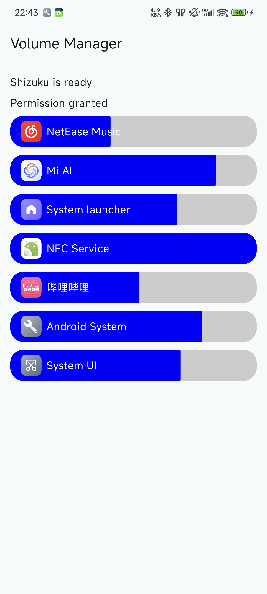

# Volume Manager

**Work in progress**

Control each app's volume independently. [Shizuku](https://shizuku.rikka.app/) is used to access privileged APIs.

Requires Android 13.

## Download

Latest development version can be downloaded from [action artifacts](https://github.com/yume-chan/VolumeManager/actions).

Some hand-picked versions can also be downloaded from [releases](https://github.com/yume-chan/VolumeManager/releases).

## Usage

1. Install and enable [Shizuku](https://shizuku.rikka.app/)
2. Launch Volume Manager and request Shizuku permission
3. It should automatically enable its accessibility service
4. You can change volume either from
   1. The main interface
   2. Press any volume button and a popup should appear, completely replace the default volume popup
   3. Enable accessibility button and click the button

## Compare to [SoundMaster from ShizuTools](https://github.com/legendsayantan/ShizuTools/wiki/SoundMaster)

This app uses hidden API to directly change each audio stream's volume.

SoundMaster uses MediaProjection API to record audio from each app and apply post-effects.

| Feature                        | Volume Manager  | SoundMaster     |
| ------------------------------ | --------------- | --------------- |
| Minimal Android version        | 13              | 10              |
| Control volume of each app     | ✅              | ✅              |
| Set output device for each app | ❌ 1 | ✅              |
| Change left-right balance      | ❌ 2 | ✅              |
| Equalizer (EQ)                 | ❌              | ✅              |
| Control protected apps         | ✅              | ❌ 3 |
| Zero latency added             | ✅              | ❌              |

1: There are APIs to do that, but not implemented in this app

2: There are other APIs to do that, but not implemented in this app

3: Can be worked around by patching the app

## How does it work

1. Use [`AudioManager#getActivePlaybackConfigurations()`](<https://developer.android.com/reference/android/media/AudioManager#getActivePlaybackConfigurations()>) to get list of [`AudioPlaybackConfiguration`](https://cs.android.com/android/platform/superproject/main/+/main:frameworks/base/media/java/android/media/AudioPlaybackConfiguration.java;drc=e282cc572ef848b1cb8d622c2c4939aac37c3b27).

   Each `AudioPlaybackConfiguration` represents a audio player, like [`AudioTrack`](https://developer.android.com/reference/android/media/AudioTrack) and [`MediaPlayer`](https://developer.android.com/media/platform/mediaplayer)

2. Use [`ActivityManager#getRunningAppProcesses()`](<https://developer.android.com/reference/android/app/ActivityManager#getRunningAppProcesses()>) and [`PackageManager#getApplicationInfo()`](<https://developer.android.com/reference/android/content/pm/PackageManager#getApplicationInfo(java.lang.String,%20android.content.pm.PackageManager.ApplicationInfoFlags)>) to map and group `AudioPlaybackConfiguration#getClientPid()` to apps
3. Use `AudioPlaybackConfiguration#getPlayerProxy()` and [`IPlayer.setVolume()`](https://cs.android.com/android/platform/superproject/main/+/main:frameworks/av/media/libaudioclient/aidl/android/media/IPlayer.aidl;l=29;drc=75e48fea431b1de2bf1715eb5c22ba4c794200bd) to update the internal volume multiplier
4. Use [`AudioManager#registerAudioPlaybackCallback()`](<https://developer.android.com/reference/android/media/AudioManager?hl=en#registerAudioPlaybackCallback(android.media.AudioManager.AudioPlaybackCallback,%20android.os.Handler)>) to listen for new `AudioPlaybackConfiguration`s and apply current volume to them.

## Note

This app uses the same API as MIUI's "Adjust media sound in multiple apps". Because this API can only setting volume, not reading, the volume set by one app will not be reflected in the other one.
